# Contributing to this GitHub Action

Simple Icons welcomes contributions and corrections. Before contributing, please make sure you have read the guidelines below. If you decide to contribute anything, please do the following:

1. Fork this repository
1. Create a new branch from the latest `master` (read more [here](https://guides.github.com/introduction/flow/))
1. Start hacking on the new branch
1. Commit and push to the new branch
1. Make a pull request

Also consider the following, this Action is tailor-made for [Simple Icons] and changes should always be made with that in mind. If you wish to implement significant changes you are perhaps better off forking this repository.

## Table of contents

* [Building](#building)
* [Release process](#release-process)

## Building

We use [@zeit/ncc](https://github.com/zeit/ncc#readme) to create a single `.js` file that contains all the source code needed to run the Action. This means that this file works without the `node_modules/` folder present.

Therefore, you should make sure the `npm run build` command does not fail due to your changes. Run `npm run build` before making a commit and include the changes in the `./lib` folder in your commit.

## Release process

1. Once a week, [a scheduled workflow][create-release-workflow] is executed in the [simple-icons repository] that triggers this action with a [`schedule` event].
2. The action creates a pull request adding the [release tag] to it trying to merge all new changes from [develop branch] into [master branch].
3. Once a maintainer approves the pull request, a [workflow][merge release workflow] is executed in the [simple-icons repository] that triggers this action with a [`pull_request_review` event].
4. The action merges the pull request into the [master branch].
5. Release is created when a [`push` event] triggers the [publish workflow] in the [simple-icons repository].

```mermaid
gantt
    title Simple Icons release process
    dateFormat HH:mm
    axisFormat %H:%M
    Scheduled release (1)           :00:00, 0min
    Action creates pull request (2) :00:05, 0min
    Pull request waits for approval :00:02, 2h
    Maintainer approves (3)         :01:56, 0min
    Action merges pull request (4)  :02:00, 0min
    Release is created (5)          :02:04, 0min
```

[Simple Icons]: https://github.com/simple-icons/simple-icons
[simple-icons repository]: https://github.com/simple-icons/simple-icons
[create-release-workflow]: https://github.com/simple-icons/simple-icons/blob/4867c03d69d851500584ae42ad2d7c544b4cdb27/.github/workflows/create-release.yml
[merge-release-workflow]: https://github.com/simple-icons/simple-icons/blob/4867c03d69d851500584ae42ad2d7c544b4cdb27/.github/workflows/merge-release.yml
[`schedule` event]: https://docs.github.com/en/actions/using-workflows/events-that-trigger-workflows#schedule
[`pull_request_review` event]: https://docs.github.com/en/actions/using-workflows/events-that-trigger-workflows#pull_request_review
[`push` event]: https://docs.github.com/en/actions/using-workflows/events-that-trigger-workflows#push
[release tag]: https://github.com/simple-icons/simple-icons/pulls?q=label%3Arelease
[develop branch]: https://github.com/simple-icons/simple-icons/tree/develop
[master branch]: https://github.com/simple-icons/simple-icons/tree/master
[publish workflow]: https://github.com/simple-icons/simple-icons/blob/4867c03d69d851500584ae42ad2d7c544b4cdb27/.github/workflows/publish.yml
